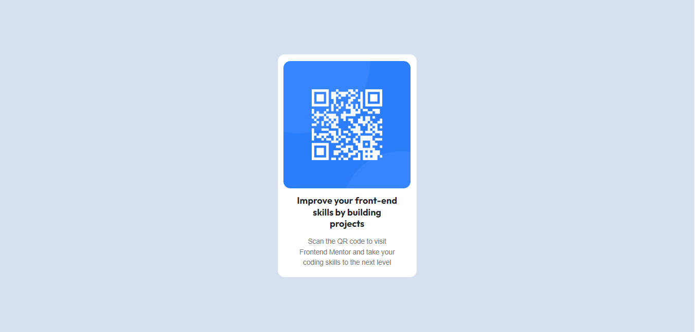

# Frontend Mentor - QR code component solution

Esta é uma solução para o [desafio do componente de código Frontend Mentor](https://www.frontendmentor.io/challenges/qr-code-component-iux_sIO_H). Os desafios do Frontend Mentor ajudam a melhorar as habilidades de codificação criando projetos realistas. 

## Índice

- [Overview](#overview)
  - [Print do Projeto](#print-do-projeto)
  - [Links](#links)
- [Meu processo](#meu-processo)
  - [Construído com](#construído-com)
  - [O que aprendi](#o-que-aprendi)
  - [Desenvolvimento contínuo](#desenvolvimento-contínuo)
- [Autor](#autor)
- [Agradecimento](#agradecimento)

## Overview

### Print do projeto



### Links

- URL da solução: [Repositório](https://github.com/maiarasteffen/qrcode_frontendmentor)
- URL do site: [Site](https://maiarasteffen.github.io)

## Meu Processo

### Construído com

- Marcação HTML5 semântica
- Propriedades personalizadas do CSS
- Flexbox
- Grade CSS
- Fluxo de trabalho móvel primeiro
- Google Fonts


### O que aprendi

Aprendi a utilizar melhor as tags e configurações css para responsividade dos blocos.

Códigos utilizados:

```html
<div class="container-qr">
    <div>
      
    </div>
    <div>
      <h1 class="h1-qr">Improve your front-end skills by building projects</h1>
    </div>
    <div>
      <p class="p-qr">Scan the QR code to visit Frontend Mentor and take your coding skills to the next level</p>
    </div>
</div>
```
```css
body {
    background-color: #D6E1F0;
}
.container-qr {
    align-items: center;
    padding-bottom: 5px;
    justify-content: center;
    margin: 4% 40%;
    width: 330px;
    background-color: #fff;
    border: none;
    border-radius: 15px;
}

.img-qr {
    margin-top: 5%;
    border: none;
    border-radius: 15px;
}

.h1-qr {
    margin: 15px;
    line-height: 25px;
    text-align: center;
    font-size: 20px;
    font-weight: 700;
    font-family: 'Outfit', sans-serif;
}


.p-qr {
    margin: 15px;
    color: #737373;
    text-align: center;
    font-size: 15px;
    font-family: sans-serif;
}
```

### Desenvolvimento contínuo

Já desenvolvo em frontend e backend, mas as atualizações em responsividades e tags novas tags ajudam a melhorar cada vez mais meu aprendizado e o raciocínio para o meu serviço.

## Autor

- Frontend Mentor - [@maiarasteffen](https://www.frontendmentor.io/profile/maiarasteffen)
- LinkedIn - [@maiarasteffen](https://www.linkedin.com/in/maiara-steffen/)
- Instagram - [@maiara_steffen](https://www.instagram.com/maiara_steffen/)


## Agradecimento

Quero agradecer muito ao [Dev em dobro](https://www.instagram.com/devemdobro/) que me ajudou em suas lives a me mostrar plataformas para desafios em programação! Esse é meu primeiro desafio do Frontend Mentor e gostei muito de fazer e não irei parar.
